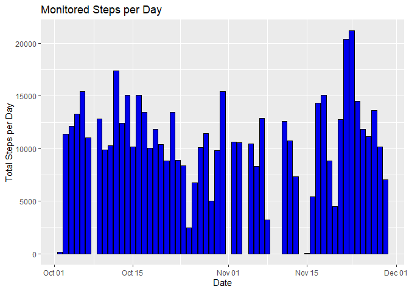
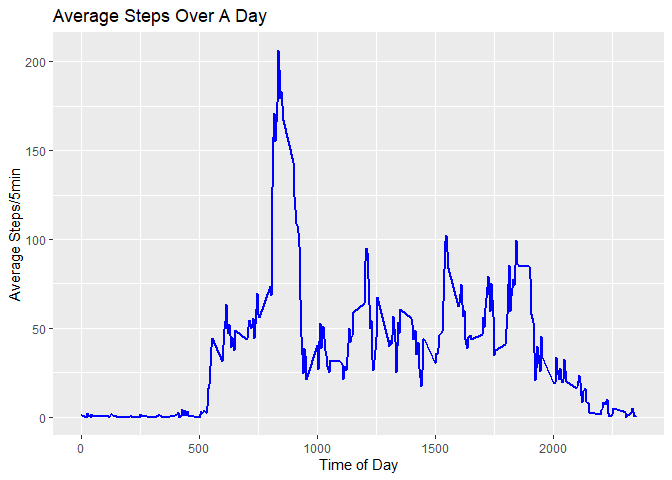
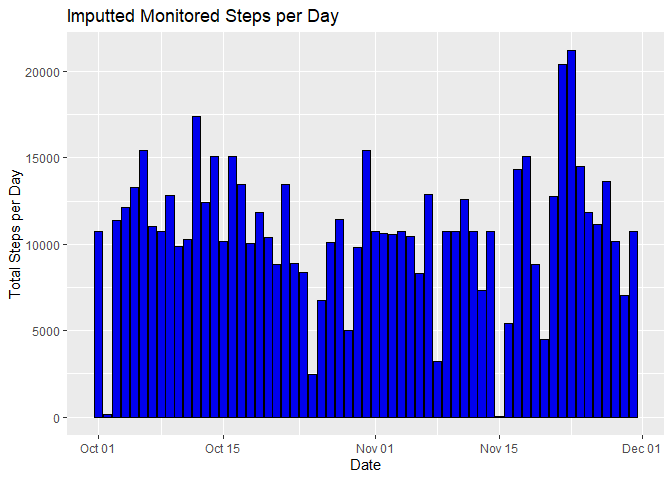
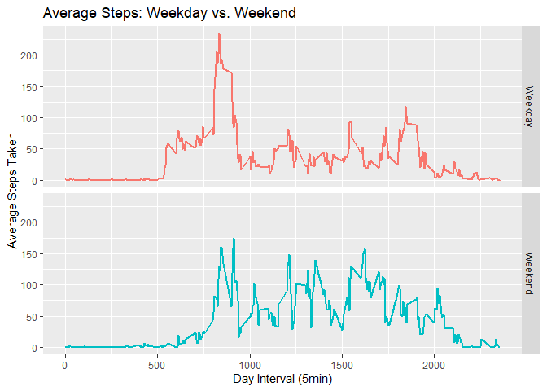

## Loading and preprocessing the data

First we will set the working environment and load required packages for processing.

```r
setwd("~/GitHub/RepData_PeerAssessment1")

library(data.table)
library(ggplot2)
library(dplyr)
library(knitr)
```

Next, we download and read data into the environment.

```r
if(!file.exists("data")){
      dir.create("data")
}

fileURL <- "https://d396qusza40orc.cloudfront.net/repdata%2Fdata%2Factivity.zip"

if(!file.exists("~/GitHub/RepData_PeerAssessment1/")) {
      download.file(fileURL, dest= "./data/dataZIP.zip", mode= "wb")
      unzip("~/GitHub/RepData_PeerAssessment1/data/dataZIP.zip", 
            exdir = "~/GitHub/RepData_PeerAssessment1/data")
      file.remove("~/GitHub/RepData_PeerAssessment1/data/dataZIP.zip")}

activity <- fread("~/GitHub/RepData_PeerAssessment1/data/activity.csv")
```

Remove NA's as they will impact statistics by including only complete cases

```r
activity_clean <- activity[complete.cases(activity),]
```


## What is mean total number of steps taken per day?

First, we need to calculate the total number of steps taken per day


```r
TotalStepsDay <- activity_clean %>% group_by(date) %>% summarise(TotalSteps = sum(steps))
```

Make a histogram of the total number of steps taken each day


```r
ggplot(TotalStepsDay, aes(x= date, y= TotalSteps))+
      geom_histogram(stat= 'identity', binwidth = 1, col= "black", fill= "blue2")+
      labs(x= "Date", y= "Total Steps per Day", title= "Monitored Steps per Day")
```

<!-- -->
    
Calculate and report the mean and median of the total number of steps taken per day.

The mean steps/day is

```r
StepsMean <- mean(TotalStepsDay$TotalSteps)
StepsMean
```

```
## [1] 10766.19
```

while the median steps/day is 

```r
StepsMedian <- median(TotalStepsDay$TotalSteps)
StepsMedian
```

```
## [1] 10765
```

## What is the average daily activity pattern?


Calculate average steps per interval period across all days


```r
AvgStepsInterval <- activity_clean %>% group_by(interval) %>% summarise(steps = mean(steps))
```

Let's take a look and plot average steps per interval over the course of the day

```r
ggplot(AvgStepsInterval)+ 
   geom_line(aes(interval, steps), color= "blue", size = 1)+
   labs(x= "Time of Day", y= "Average Steps/5min", title= "Average Steps Over A Day")
```

<!-- -->


## Imputing missing values

Calculate and report the total number of missing values in the dataset (i.e. the total number of rows with NAs)


```r
sum(is.na(activity$steps))
```

```
## [1] 2304
```

Create a new dataset that is equal to the original dataset but with the missing data filled in.

First, we'll replace NA's of missing steps with mean steps of that specific interval.  This is due to missing
data for 8 days.  This will be the same as replacing the missing days with the mean total sum of those days.


```r
Activity_Imput <- activity %>% inner_join(AvgStepsInterval, by= "interval") %>%
   mutate(steps = coalesce(steps.x, steps.y)) %>%
   select(date, interval, steps)
```

After replacing missing intervals we need to calculate the total steps per day for each day.


```r
ImputTotalStepsDay <- Activity_Imput %>% group_by(date) %>% summarise(TotalSteps = sum(steps))
ImputStepsMean <- mean(ImputTotalStepsDay$TotalSteps)
ImputStepsMedian <- median(ImputTotalStepsDay$TotalSteps)
```

Make a histogram of the total number of steps taken each day and Calculate and report the mean and 
median total number of steps taken per day. Do these values differ from the estimates from the first 
part of the assignment? What is the impact of imputing missing data on the estimates of the total 
daily number of steps?


```r
ggplot(ImputTotalStepsDay, aes(x= date, y= TotalSteps))+
   geom_histogram(stat= 'identity', col= "black", fill= "blue2")+
   labs(x= "Date", y= "Total Steps per Day", title= "Imputted Monitored Steps per Day")
```

<!-- -->

The imputted mean steps/day is

```r
ImputStepsMean
```

```
## [1] 10766.19
```

while the imputted median steps/day is 

```r
ImputStepsMedian
```

```
## [1] 10766.19
```

Based on these results the mean and median did not change, compared to initial calculations in the 
first section inidcating that data was correctly cleaned in the first section.  If the numbers had changed
it would have indicated that errors from the NA were contributing to calculations of the mean/median.
However, in general imputting the missing data can potentially falsely affirm observed values.


## Are there differences in activity patterns between weekdays and weekends?

First, we will use the cleaned activity dataset (activity_clean). To add day of the week and convert
to weekday (Monday - Friday) or weekend (Saturday - Sunday).


```r
activity_clean$Day <- weekdays(as.Date(activity_clean$date))
activity_clean$Day <- as.factor(activity_clean$Day)
levels(activity_clean$Day) <-list(
   Weekday = c("Monday", "Tuesday", "Wednesday", "Thursday", "Friday"), 
   Weekend = c("Saturday", "Sunday")
)
```

Next, we need to calculate the average steps per interval for each weekdays or weekends.


```r
AvgStepsWkInterval <- activity_clean %>% group_by(interval, Day) %>% summarise(steps = mean(steps))
```

Next, we need to create plots for each weekday and weekend.


```r
ggplot(AvgStepsWkInterval)+ 
   geom_line(aes(interval, steps, color = Day), size = 1)+
   labs(x= "Day Interval (5min)", y= "Average Steps Taken", title= "Average Steps: Weekday vs. Weekend") +
   facet_grid(rows = vars(Day)) +
   theme(legend.position="none")
```

<!-- -->
